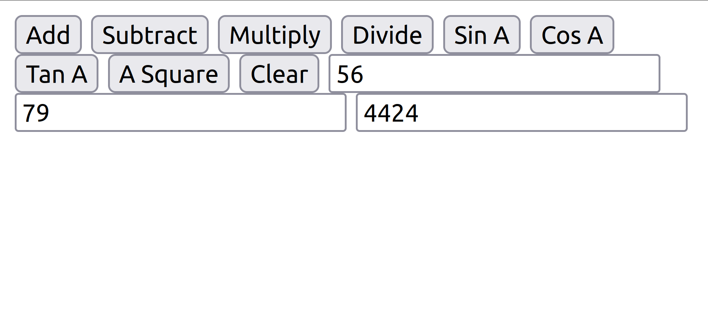

# Design of a Standard Calculator

## AIM:

To design a web application for a standard calculator.

## DESIGN STEPS:

### Step 1:
First clone the url in vs code after creating fork.

### Step 2:
Create django environment in which program run.

### Step 3:
create the myproj and static and html.

### Step 4:
Under static create index.html in which paste code.

### Step 5:
Save and run the server.

### Step 6:

Stop the code.

### Step 6:

localhost:8000/static/html/index.html is the required url to get the output.

## PROGRAM :
```
<html>
<head>
<script type="text/javascript">
function f1()
{
var a=Number(document.getElementById("n1").value);
var b=Number(document.getElementById("n2").value);
document.getElementById("n3").value=a+b;
}
function f2()
{
var a=Number(document.getElementById("n1").value);
var b=Number(document.getElementById("n2").value);
document.getElementById("n3").value=a-b;
}
function f3()
{
var a=Number(document.getElementById("n1").value);
var b=Number(document.getElementById("n2").value);
document.getElementById("n3").value=a*b;
}
function f4()
{
var a=Number(document.getElementById("n1").value);
var b=Number(document.getElementById("n2").value);
document.getElementById("n3").value=a/b;
}
function f5()
{
var a=Number(document.getElementById("n1").value);
var b=Number(document.getElementById("n2").value);
document.getElementById("n3").value=Math.sin(a);
}
function f6()
{
var a=Number(document.getElementById("n1").value);
var b=Number(document.getElementById("n2").value);
document.getElementById("n3").value=Math.cos(a);
}
function f7()
{
var a=Number(document.getElementById("n1").value);
var b=Number(document.getElementById("n2").value);
document.getElementById("n3").value=Math.tan(a);
}


function f8()
{
var a=Number(document.getElementById("n1").value);
var b=Number(document.getElementById("n2").value);
document.getElementById("n3").value=a*a;
}
function f9()
{
document.getElementById("n1").value=" ";
document.getElementById("n2").value=" ";
document.getElementById("n3").value=" ";
}
</script>
</head>
<body>
<form>
<input type="button" onclick="f1()"  value="Add">
<input type="button" onclick="f2()"  value="Subtract">
<input type="button" onclick="f3()"  value="Multiply">
<input type="button" onclick="f4()"  value="Divide">
<input type="button" onclick="f5()"  value="Sin A">
<input type="button" onclick="f6()"  value="Cos A">
<input type="button" onclick="f7()"  value="Tan A">
<input type="button" onclick="f8()"  value="A Square">
<input type="button" onclick="f9()"  value="Clear">
<input type="text" id="n1">
<input type="text" id="n2">
<input type="text" id="n3">
</form>
</body>
</html>
```

## OUTPUT:


## Result:
Thus the program created successfully.

